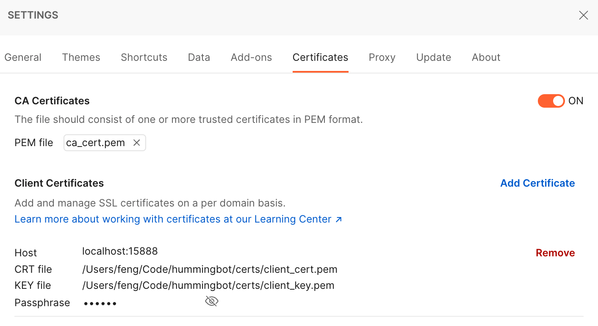
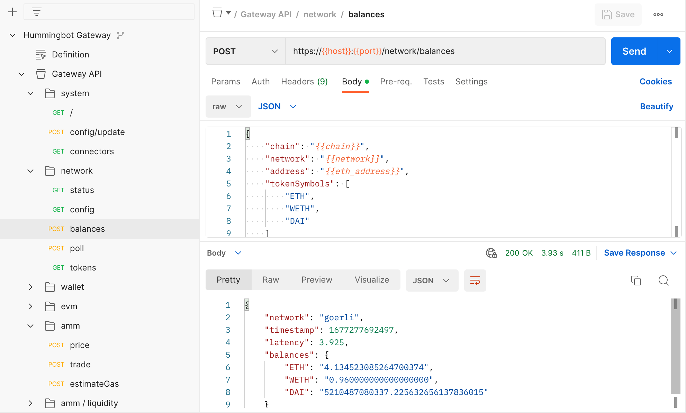

After the Gateway server is running, we recommend testing out the endpoints using the supplied Postman collection and environment. 

In addition, you can also run unit tests and manual test scripts if you have installed Gateway from source.

These methods allows you to test out the endpoints and understand how Gateway works, before interacting with it through the Hummingbot client. This is an important step because you will likely need to configure your node provider, gas settings, wallet, and other dependencies in order to run DEX trading bots successfully, and understanding Gateway's behavior on a standalone basis helps tremendously.

## Testing with Postman

[Postman](https://www.postman.com/) is an app that helps you interact with API endpoints. 

The official Hummingbot Postman workspace is: [https://www.postman.com/hummingbot](https://www.postman.com/hummingbot). Here, you can download collections and environments for use with Hummingbot.

Postman is the easiest way to test Gateway on a standalone basis. In the future, we should encourage community maintainers to upload DEX and chain-specific collections to the Hummingbot workspace.

### Adding certificates

Download and install the desktop version of Postman on your machine. You first have to establish a secure connection with your Gateway instance using certificates in the settings section, so the web version won’t work.

First, go to **Settings** >> **Certificates** in Postman:

[](./postman-certs-1.png)

In this view, eable the **CA Certificates** toggle, Then go to the **certs_path** folder location from [Installation - Generating Certs](/gateway/installation/#generate-certs). Add the `ca_cert.pem` from this folder to **PEM file** in Postman.

[](./postman-certs-2.png)

In the **Client Certificates** section, set the following:

* Host: localhost:15888 (or the port where you are running Gateway)
* CRT file: path to the `client_cert.pem` file in your **certs_path**
* KEY file: path to the `client_key.pem` file in your **certs_path**
* Passphrase: the **passphrase** you defined from [Installation - Generating Certs](/gateway/installation/#generate-certs)

### Importing collection/environment

You can also find Postman collections and environments from the [/postman](https://github.com/hummingbot/gateway/tree/main/postman) folder in the Gateway repo.

Import the GatewayAPI collection and the acccompanying Gateway environment into your Postman app in order to test the Gateway endpoints.

### Running tests

After you have imported the collection and environment, test the various endpoints and change the request parameters to understand the their behavior. This will help you understand the speed/latency of each endpoint and configure important setting, especially your node provider, to match your trading style.

By convention, the POST requests have sample request payloads in the Body field, which allows you to run the same

[](./postman-balances.png)


## Testing with `curl` scripts

If you have installed Gateway from source, you can also run the `curl` test scripts, defined in the [/test-helpers/curl/curl.sh](https://github.com/hummingbot/gateway/blob/main/test-helpers/curl/curl.sh) file. 

### Setup

To run the scripts, ensure that you have [curl](https://curl.se/) and [envsubst](https://www.gnu.org/software/gettext/manual/html_node/envsubst-Invocation.html) installed in your system first.

On Linux and Windows/WSL systems, you can install these with `sudo apt install curl` and `sudo apt install envsubst` On MacOS, you can run `brew install curl` and `brew install envsubst` if you have Homebrew.

Next, go into the [/test-helpers/curl/](https://github.com/hummingbot/gateway/tree/main/test-helpers/curl) directory in your machine, since the curl commands reference request payload JSON files stored in the [/test-helpers/curl/requests/](https://github.com/hummingbot/gateway/tree/main/test-helpers/curl/requests) folder.

Finally, define the `GATEWAY_CERT` and `GATEWAY_KEY` environment variables. These are the paths to `client_cert.pem` and `client_key.pem` in your **certs_path**, respectively. 

Here's an example:
```bash
$ export GATEWAY_CERT="/Users/feng/hummingbot/certs/client_cert.pem"
$ export GATEWAY_KEY="/Users/feng/hummingbot/certs/client_cert.key"
$ export ETH_ADDRESS='<publicAddress>
```

### Running tests

Now, you an copy and paste individual commands into Bash/Terminal to execute the tests accordingly.

!!! tip
    When using curl any of the tests that can be run using `uniswap` can be run on `sushiswap` connector or any future compatible connector that is similar to Uniswap by simply replacing the connector value in the JSON file.

Here are a few examples:

#### GET /
```bash
$ curl -s -X GET -k --key $GATEWAY_KEY --cert $GATEWAY_CERT https://localhost:15888/ | jq

{
  "status": "ok"
}
```

#### GET /connectors
```bash
$ curl -s -X GET -k --key $GATEWAY_KEY --cert $GATEWAY_CERT https://localhost:15888/connectors | jq

{
    "connectors": [
			......,
        {
            "name": "sushiswap",
            "trading_type": [
                "EVM_AMM"
            ],
            "available_networks": [
                {
                    "chain": "ethereum",
                    "networks": [
                        "mainnet",
                        "kovan",
                        "ropsten"
                    ]
                }
            ]
        }
    ]
}
```

## Unit tests

To maintain a high quality bar, connector developers must add unit tests when contributing connectors.

If you have installed Gateway from source, you can run these unit tests locally from the root directory:

```bash
# run all unit tests
$ yarn test:unit 

# run all unit tests for a single connector
$ yarn jest test/connector/uniswap

# run all unit tests for a single chain
$ yarn jest test/chain/ethereum

# run a single unit test
$ yarn jest test/chains/ethereum/ethereum.controller.test.ts
```

!!! note "Writing unit tests"
    If you are looking to add a connector to Gateway, read this document for more details about how to write unit tests: [Writing unit tests for gateway](https://github.com/hummingbot/gateway/blob/main/docs/testing.md).
